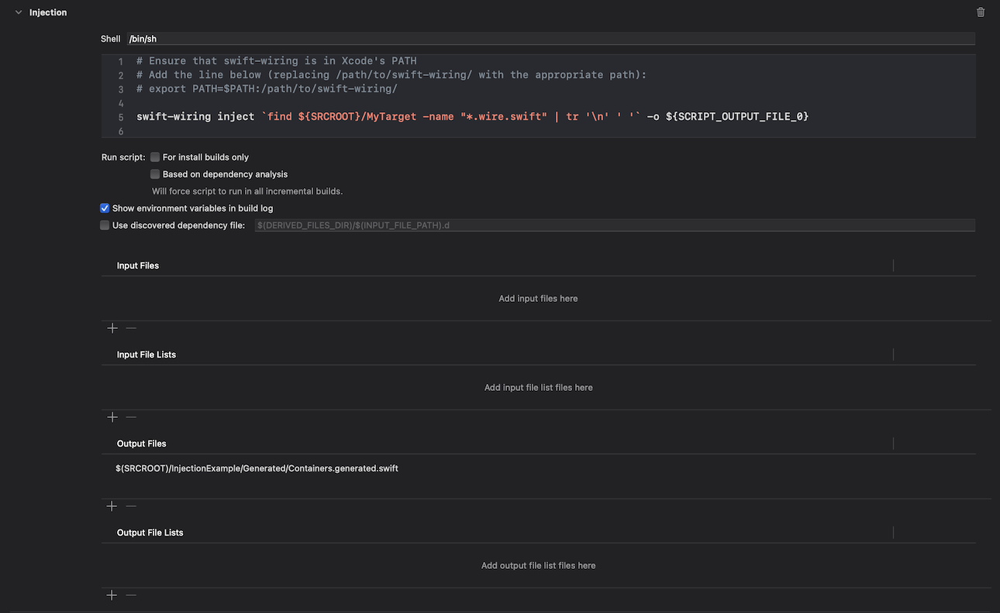

# Installation

## How to install it?

You can install this command line tool with [Mint](https://github.com/yonaskolb/Mint), by running:

```shell
mint install fabio914/swift-wiring@main
```

Alternatively, you can clone this repository and run `sudo install.sh` to install it in `/usr/local/bin`.

# Configuration

## How to use it?

```shell
swift-wiring inject <source files> -o <output file with your Containers>
```

### 1. Configure your Xcode Target 

Add a "New Run Script Phase" to your target on Xcode to be able to run Swift Wiring as part of its build.

First, add `export PATH=$PATH:/path/to/swift-wiring/` to your script to add Swift Wiring to Xcode's PATH (if it's not already in that PATH), where `/path/to/swift-wiring/` should be replaced with the path to Swift Wiring, for example: `export PATH=$PATH:~/.mint/bin` if you installed it with Mint.

Swift Wiring only needs to read the Swift files in your target that require dependency injection.

You can then either list all the necessary input Swift files in the "Input files" section (and enable the "Run script: Based on dependency analysis" option), or alternatively you can add the `.wire.swift` extension to the files you want Swift Wiring to scan, and use the following:

```shell
find ${SRCROOT}/MyTarget -name "*.wire.swift" | tr '\n' ' '
```

to make the script find the path of all files ending in `.wire.swift` (where `MyTarget` is your the name of your target).

Example:

```shell
swift-wiring inject `find ${SRCROOT}/MyTarget -name "*.wire.swift" | tr '\n' ' '` -o ${SCRIPT_OUTPUT_FILE_0}
```

Now add an empty `Containers.generated.swift` file to your target, and add the path to this file to the "Output files" section (example: `$(SRCROOT)/MyTarget/Generated/Containers.generated.swift`). This is the file where Swift Wiring will output the code for your Containers.



### 2. Create your first Container


### 3. Annotate your Injectable Classes and Functions, and Dependencies


# Swift Wiring Syntax

## Available `sw:` commands

### Inject

| Syntax | `sw: inject` |
|---|---|
| Examples | `sw: inject` or `sw: inject()` |

### Dependency

| Syntax | `sw: dependency(OptionalName?)` |
|---|---|
| Examples | `sw: dependency`, `sw: dependency()` or `sw: dependency(SomeName)` |

### Container


| Syntax |
|---|
| 
```
sw: container(ContainerName) {
    // container subcommands
}
``` 
|

| Example |
|---|
|
```
sw: container(MyContainer) {
    // Single line comments are allowed here
    build(MyClass)
    build(MyClass, MyProtocol) {
        // Single line comments are allowed here too
        access(public)
        name(SpecialDependency)
    }
    singleton(MyOtherClass)
    singleton(MyOtherClass, MyProtocol) {
        access(internal)
    }
}
```
|

## Container subcommands

### Access

### Build

### Singleton

## Binding subcommands

### Access

### Name

